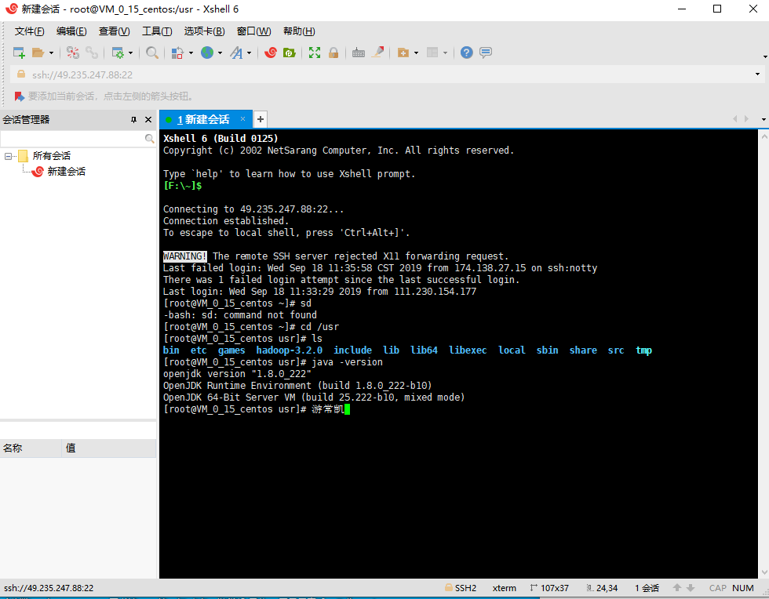

# 实验报告

## 实验一：云计算开发基础

**一、实验内容**：

 

1.1购买腾讯云服务器，使用Web Shell登录已购买的云服务器实例

1.2下载Xshell，并使用登录腾讯云实例

2.1 注册GitHub账号

2.2 在GitHub上创建云计算项目（CloudComputing）并在本地同步

3.1安装VMware WorkStation

3.2在VMware WorkStation安装CentOS操作系统

 

**二、实验步骤**

**1.1购买腾讯云服务器，使用Web Shell登录已购买的云服务器实例**

（一）步骤一：购买腾讯云服务器

（二）步骤二：使用Web Shell登录

**1.2下载Xshell，并使用登录腾讯云实例**

（一）步骤一：下载并安装Xshell

（二）步骤二：查找腾讯云公网地址，使用Xshell登录

（三）步骤三：使用Xshell登录，输入用户密码

 

**2.1 注册GitHub账号**

前往GitHub官网注册

 

**2.2 在GitHub上创建云计算项目（CloudComputing）并在本地同步**

（一）步骤一：安装Git

（二）步骤二：创建SSH Key

验证后发现不存在ssh keys，创建新的ssh key

查看“id_rsa”和“id_rsa.pub”两个文件

（三）步骤三：配置SSH Key

复制“id_rsa.pub”的内容到GitHub网站的Settings–>SSH and GPG keys中

测试SSH Key是否配置成功

（四）步骤四：配置GitHub的用户名和邮箱

（五）步骤五：创建GitHub项目并在本地进行同步

访问GitHub网站并新建代码仓库Cloudcomputing

创建本地代码仓库，并且拷贝GitHub网站中的项目网址

添加远程代码仓库的URL，并验证添加是否成功

新建README文档

添加文件夹中的所有文件

提交文件

推送本地更新至远程服务器

**3.1安装VMware WorkStation**

下载并安装VMware WorkStation

**3.2在VMware WorkStation安装CentOS操作系统**

安装centos镜像文件

配置虚拟机设置

安装成功

 