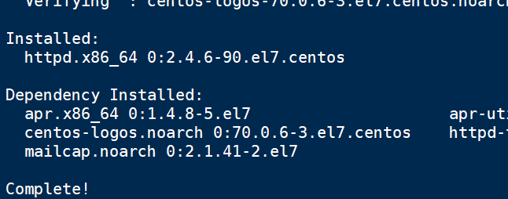
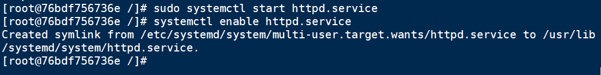
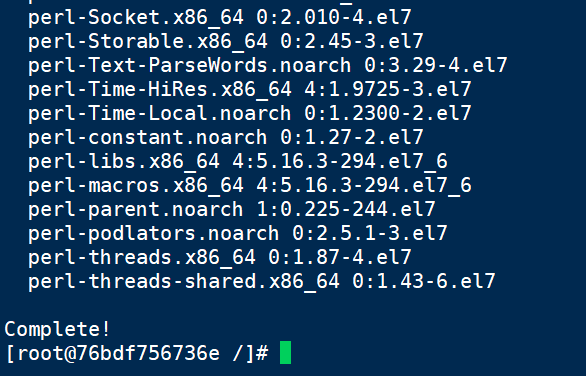

# 实验报告

## 实验三：Docker基础实验

### 一、实验内容

 **1.安装Docker**

 **2.拉取CentOS镜像，并基于该镜像运行容器，在容器实例上完 成WordPress的安装，并推送到Docker Hub** 

 **3.利用Dockerfile创建一个完成WordPress安装的镜像**  

3.2dockerfile：https://github.com/letmeccyck/Cloudcomputing/tree/master/docker/3.2.md

### 二、实验步骤

#### ①安装Docker

（一）更新应用程序数据库

（二）添加Docker仓库，安装最新版的Docker

   

（三）启动Docker与设置Docker自启动

sudo systemctl start docker

sudo systemctl enable docker

   

（四）查看Docker版本信息

   

Docker加载CentOS 7 镜像

（一）拉取CentOS 7 镜像

docker pull centos:7   

（二）拉取完毕后查看镜像

docker images  

 

（三）运行Docker容器（为了方便检测后续wordpress搭建是否成功，需设置端口映射（-p），将容器端口80 映射到主机端口8888，Apache和MySQL需要 systemctl 管理服务启动，需要加上参数 –privileged 来增加权，并且不能使用默认的bash，换成 init，否则会提示 Failed to get D-Bus connection: Operation not permitted ，-name 容器名 ，命令如下 ）

docker run -d -it --privileged --name wordpress -p 8888:80 -d centos:7 /usr/sbin/init

   

（四）查看已启动的容器

docker ps

​    

 

(五)进入到容器前台

 

docker exec -it 76bdf756736e /bin/bash

​    

 

 

#### ②拉取CentOS镜像，并基于该镜像运行容器，在容器实例上完 成WordPress的安装，并推送到Docker Hub 

 

（一）一开始不能使用sudo命令，使用yum安装后使用

yum install sudo

​    

 

 

（二）安装Apache Web服务器

 

sudo yum install httpd

使用yum安装

​     

安装完成！

 

安装完成后，启动Apache Web服务器

并设置开机自启

sudo systemctl start httpd.service

systemctl enable httpd.service

​       

 

访问我的云服务器公网IP，8888端口，出现下图代表Apache安装成功

   

​        

（三）安装MySQL

 

安装MariaDB

sudo yum install mariadb-server mariadb

  

​          

启动MariaDB

sudo systemctl start mariadb   

设置MySQL的root密码

sudo mysql_secure_installation

​        

​       

设置开机自启动MariaDB

sudo systemctl enable mariadb.service

​            

   

 

（四）安装PHP

sudo yum install epel-release yum-utils

​            

​            

   

   

 

sudo yum install http://rpms.remirepo.net/enterprise/remi-release-7.rpm

   

​          

   

更新PHP版本

sudo yum-config-manager --enable remi-php72

​            

   

安装PHP以及php-mysql

sudo yum install php php-mysql

​      

   

查看安装的php版本

php -v

​            

   

 

重启Apache服务器以支持PHP

sudo systemctl restart httpd.service

   

 

   

启动PHP附加模块

sudo yum install php-fpm php-gd

​      

   

安装service服务以执行命令

​            

   

重启Apache服务

sudo service httpd restart      

   

（五）安装WordPress以及完成相关配置

 

登录数据库

mysql -u root -p   

   

为WordPress创建一个新的数据库

CREATE DATABASE DockerDB ;

​      

 

进入数据库DockerDB

Use DockerDB;

​        

为WordPress创建一个独立的MySQL用户并授权给数据库访问权限

CREATE USER yck@localhost IDENTIFIED BY '103099@qet';

GRANT ALL PRIVILEGES ON DockerDB.* TO yck@localhost IDENTIFIED BY '103099@qet';

​      

 

刷新MySQL的权限

FLUSH PRIVILEGES;

​    

安装WordPress

 

wget http://wordpress.org/latest.tar.gz

tar xzvf latest.tar.gz

 

解压之后在主目录下产生一个wordpress文件夹。我们将该文件夹下的内容同步到Apache服务器的根目录下，使得wordpress的内容能够被访问。这里使用rsync命令：

接着在Apache服务器目录下为wordpress创建一个文件夹来保存上传的文件：

 

sudo rsync -avP ~/wordpress/ /var/www/html/

mkdir /var/www/html/wp-content/uploads

sudo chown -R apache:apache /var/www/

​      

 

大多数的WordPress配置可以通过其Web页面完成，但首先通过命令行连接WordPress和MySQL。

定位到wordpress所在文件夹：

 

cd /var/www/html

WordPress的配置依赖于wp-config.php文件，当前该文件夹下并没有该文件，我们通过拷贝wp-config-sample.php文件来生成：

 

cp wp-config-sample.php wp-config.php

 

然后，通过vi文本编辑器来修改配置，主要是MySQL相关配置：

 

vi wp-config.php

​      

 

（六）注册Wordpress

经过上述的安装和配置，WordPress运行的相关组件已经就绪，接下来通过WordPress提供的Web页面进一步配置。输入你的IP地址或者域名：

 

http://49.235.247.88:8888/

 

出现如下界面：

   

   

​      

 

​      

 

成功登录

 

（七）推送带有wordpress的镜像

 

前往docker hub注册账号

   

​      

​    

将容器生成镜像

docker commit -a "yck729862543" -m "wordpress on centos7" 76bdf756736e yck729862543/centos:v1

   

​    

登录Docker

   

​    

推送镜像：

docker push yck729862543/centos:v1

​      

登录查看一下，成功

​      

   

###    ③利用Dockerfile创建一个完成WordPress安装的镜像并推送 到Docker Hub

https://github.com/letmeccyck/Cloudcomputing/tree/master/docker/3.2.md

   

   

   

   

   

   

   

   

   

 

   

   