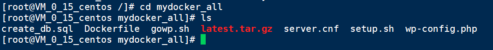
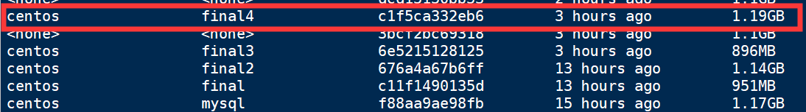
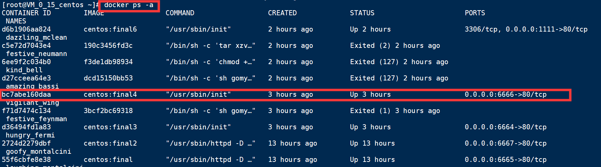
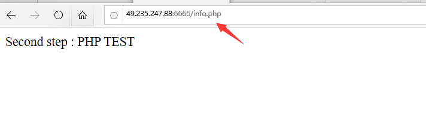
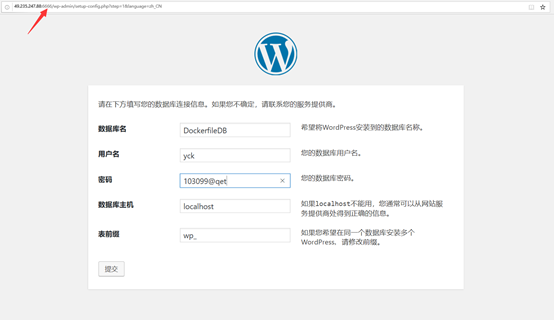
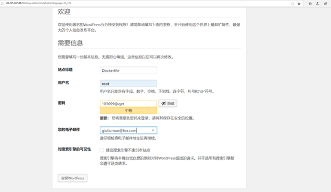
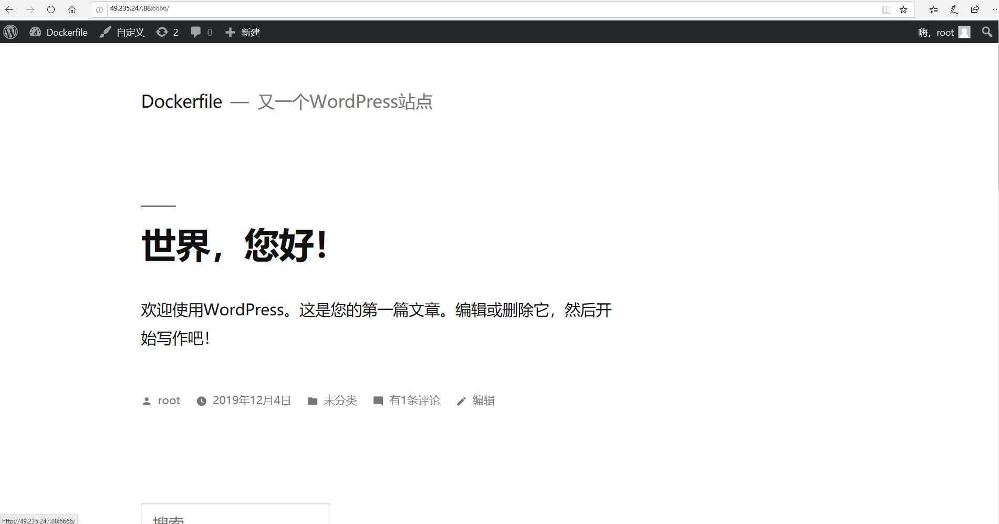

# 实验报告

## 实验三：Dockerfile实验

### 一、实验内容


 **1.安装Docker**

 **2.拉取CentOS镜像，并基于该镜像运行容器，在容器实例上完 成WordPress的安装，并推送到Docker Hub** 

   *3.1docker基础实验：https://github.com/letmeccyck/Cloudcomputing/tree/master/docker/3.1.md*

 **3.利用Dockerfile创建一个完成WordPress安装的镜像并推送 到Docker Hub**  


### 二、实验步骤


###    ③利用Dockerfile创建一个完成WordPress安装的镜像并推送 到Docker Hub


###     1、 Docker文件结构

###    mydocker
### ├── Dockerfile

### ├── gowp.sh

### ├── create_db.sql

### ├── server.cnf

### ├── setup.sh

###    ├── wp-config.php

###    └── latest.tar.gz

### 详见：




###  2、创建Dockerfile

```
FROM centos:7
ADD gowp.sh /
ADD wp-config.php /var/www/html/wp-config.php
#安装httpd
RUN yum install  httpd -y
#安装php
RUN yum install epel-release yum-utils -y
RUN yum install http://rpms.remirepo.net/enterprise/remi-release-7.rpm  -y
RUN yum-config-manager --enable remi-php72 -y
RUN yum install php php-mysql -y
RUN yum install rsync -y

#安装mysql
RUN yum install mariadb-server mariadb -y
WORKDIR /root
ADD create_db.sql /root/create_db.sql
ADD server.cnf /etc/my.cnf.d/server.cnf
ADD setup.sh /root/setup.sh
RUN yum clean all
RUN chmod +x /root/setup.sh
#安装wordpress
WORKDIR /
COPY latest.tar.gz /
RUN  tar xzvf latest.tar.gz
RUN sh gowp.sh
#暴露端口
EXPOSE 3306 80
CMD ["/root/setup.sh"]
```

### 3、创建镜像

```
docker build -t centos:final4 .
//查看镜像
docker images
```



### 4、启动容器

```
docker run -d -it --privileged -p 6666:80 -d centos:final4 /usr/sbin/init
//查看容器
docker ps -a
```

 

### 5、验证PHP



### 6、验证MySQL





###  7、验证apache+Wordpress




可访问：http://49.235.247.88:6666/

   