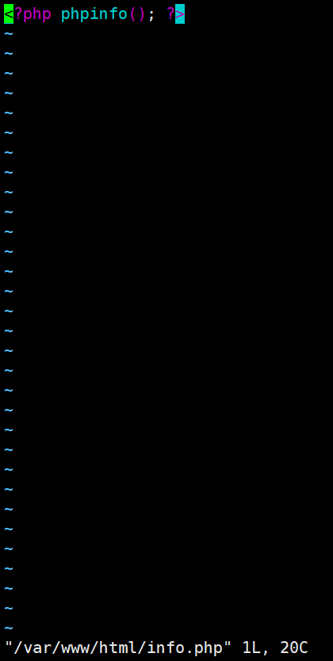

# 实验报告

## 实验二：基于腾讯云创建个人网站

**一、实验内容**：

 

使用WordPress创建个人网站

 

**二、实验步骤**

**1.安装Apache Web服务器**

（一）步骤一：使用yum工具安装

   sudo yum install httpd

（二）步骤二：sudo命令获得了root用户的执行权限，因此需要验证用户口令。
安装完成之后，启动Apache Web服务器：

sudo systemctl start httpd.service

（三）步骤三：测试Apache服务器是否成功运行，找到腾讯云实例的公有IP地址(your_cvm_ip)，在你本地主机的浏览器上输入：

我的地址http://49.235.247.88/

若运行正常，将出现如下界面：

**2.安装MySQL**

（一）步骤一：CentOS 7.2的yum源中并末包含MySQL，需要其他方式手动安装。因此，我们采用MySQL数据库的开源分支MariaDB作为替代。
安装MariaDB：

sudo yum install mariadb-server mariadb

（二）步骤二：安装好之后，启动mariadb：

  sudo systemctl start mariadb

（三）步骤三：随后，运行简单的安全脚本以移除潜在的安全风险，启动交互脚本：

sudo mysql_secure_installation

（四）步骤四：设置相应的root访问密码以及相关的设置(都选择Y)。
最后设置开机启动MariaDB：

sudo systemctl enable mariadb.service

**2.安装PHP**

（一）步骤一：PHP是一种网页开发语言，能够运行脚本，连接MySQL数据库，并显示动态网页内容。
默认的PHP版本太低（PHP 5.4.16），无法支持最新的WordPress（笔者写作时为5.2.2），因此需要手动安装PHP较新的版本(PHP 7.2)。
PHP 7.x包在许多仓库中都包含，这里我们使用Remi仓库，而Remi仓库依赖于EPEL仓库，因此首先启用这两个仓库

sudo yum install epel-release yum-utils
sudo yum install http://rpms.remirepo.net/enterprise/remi-release-7.rpm

（二）步骤二：接着启用PHP 7.2 Remi仓库：

sudo yum-config-manager --enable remi-php72

（三）步骤三：安装PHP以及php-mysql

sudo mysql_secure_installation

（四）步骤四：查看安装的php版本：

php -v

（五）步骤五：安装之后，重启Apache服务器以支持PHP：

 sudo systemctl restart httpd.service

**3.安装PHP模块**

（一）步骤一：为了更好的运行PHP，需要启动PHP附加模块，使用如下命令可以查看可用模块：

yum search php-

（二）步骤二：这里先行安装php-fpm(PHP FastCGI Process Manager)和php-gd(A module for PHP applications for using the gd graphics library)，WordPress使用php-gd进行图片的缩放。

sudo yum install php-fpm php-gd

（三）步骤三：重启Apache服务：

sudo service httpd restart

**4.测试PHP**

（一）步骤一：这里我们利用一个简单的信息显示页面（info.php）测试PHP。创建info.php并将其置于Web服务的根目录（/var/www/html/）：

sudo vim /var/www/html/info.php

该命令使用vim在/var/www/html/处创建一个空白文件info.php，我们添加如下内容：

（二）步骤二：完成之后，使用刚才获取的cvm的IP地址，在你的本地主机的浏览器中输入:

49.235.247.88/

即可看到如下界面：

**5.安装WordPress以及完成相关配置**

（一）步骤一：为WordPress创建一个数据库

首先以root用户登录MySQL数据库：

mysql -u root -p

键入之前设置的root用户密码，并按下回车键进入MySQL命令行模式。

首先为WordPress创建一个新的数据库：

CREATE DATABASE wordpress;

接着为WordPress创建一个独立的MySQL用户：

CREATE USER wordpressuser@localhost IDENTIFIED BY 'password';

“wordpressuser”和“password”使用你自定义的用户名和密码。授权给wordpressuser用户访问数据库的权限：

GRANT ALL PRIVILEGES ON wordpress.* TO wordpressuser@localhost IDENTIFIED BY 'password';

随后刷新MySQL的权限：

最后，退出MySQL的命令行模式：exit

（二）步骤二：安装WordPress

下载WordPress至当前用户的主目录：

cd ~
wget http://wordpress.org/latest.tar.gz

wget命令从WordPress官方网站下载最新的WordPress集成压缩包，解压该文件：

解压之后在主目录下产生一个wordpress文件夹。我们将该文件夹下的内容同步到Apache服务器的根目录下，使得wordpress的内容能够被访问。这里使用rsync命令：

sudo rsync -avP ~/wordpress/ /var/www/html/

接着在Apache服务器目录下为wordpress创建一个文件夹来保存上传的文件：

mkdir /var/www/html/wp-content/uploads

对Apache服务器的目录以及wordpress相关文件夹设置访问权限：

这样Apache Web服务器能够创建、更改WordPress相关文件，同时我们也能够上传文件。

（三）步骤三：配置WordPress

大多数的WordPress配置可以通过其Web页面完成，但首先通过命令行连接WordPress和MySQL。
定位到wordpress所在文件夹：

cd /var/www/html

WordPress的配置依赖于wp-config.php文件，当前该文件夹下并没有该文件，我们通过拷贝wp-config-sample.php文件来生成：

cp wp-config-sample.php wp-config.php

然后，通过nano超简单文本编辑器来修改配置，主要是MySQL相关配置：

nano wp-config.php

将文件中的DB_NAME，DB_USER和DB_PASSWORD更改成之前为WordPress创建的数据库的相关信息，这三处信息是当前唯一需要修改的。

（四）步骤四：通过Web界面进一步配置WordPress

经过上述的安装和配置，WordPress运行的相关组件已经就绪，接下来通过WordPress提供的Web页面进一步配置。输入你的IP地址或者域名：

http://49.235.247.88/

出现如下界面：

设置网站的标题，用户名和密码以及电子邮件等，点击**Install WordPress**，弹出确认页面

点击**Log In**，弹出登录界面：

输入用户名和密码之后，进入WordPress的控制面板：

